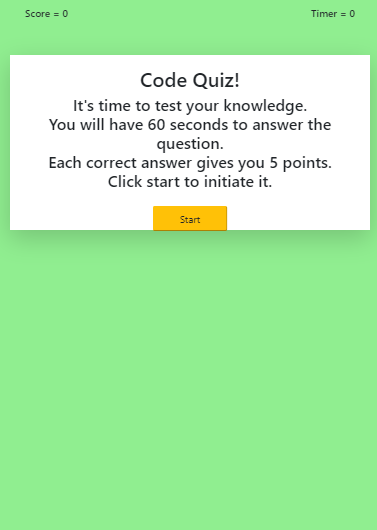
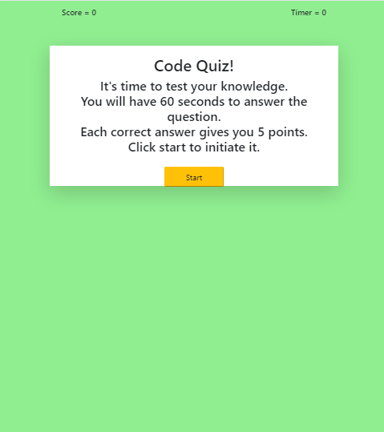

Simple Quiz build with JavaScript, Html and CSS Bootstrap. 
The quiz is timed and the player has 60 seconds to answer the 5 questions. Each correct question it's 5 points.
At the end, the user initials  and score are stored in the localStorage.  
I made this application displaying and hidding content as the quiz goes. Each questions has a function that is called right after a button it's clicked.  
I will come back to fix the scores and the timer because the math behind it it's incorrect. I was not able to target my buttons because in each loop they held a diferrent value.  For practice purposes, I decided to increase the score no mater which choice was clicked.  

**Key words**: 
    *Js Vanilla*,
    *Timers*,
    *Document Object Model (DOM)*,
    *Form events*,
    *Web APIs and interfaces*,
    *Event delegation*,
    *Loops*.
    *Functions*
    
### Technologies-Libraries
- [Bootstrap](https://getbootstrap.com/) - CSS Framework

### Link
Check it out! 
 https://cibellem.github.io/Code-Quiz/

Below are some screenshots on how the application it's going to look in diferent screens size:  

  
  
  
